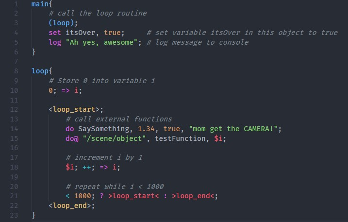

# Loproc language support for vscode

This extension for vscode adds support for Loproc (**LO**w-level **PRO**cedural) language files with the **.lp** extension.

## Features

- Color highlighting

*Image taken using the theme One Dark Pro and the font FiraCode*

-----------------------------------------------------------------------------------------------------------
## Known Issues

No known issues (yet).

## Release Notes

- Added sysntax highlighting

### 0.0.1

Initial release of Loproclang.